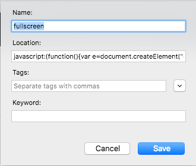

# fullscreen mode in Firefox Browser

Direct reference: https://de.switch-case.com/70880799 

1. If you want to make a bookmarklet on full screen mode:
- copy and paste the code 
- To make a bookmarklet in Firefox to achieve FullScreen mode



```javascript
javascript:(function(){var e=document.createElement("div"),t=document.documentElement;e.innerText="Go to fullscreen view";e.setAttribute("style","position: fixed; top: 10%; left: 10%; padding: 30%; background: #000; color: #fff; opacity: .7; cursor: pointer;");document.body.appendChild(e);e.onclick=function(){if(t.requestFullscreen){t.requestFullscreen()}else if(t.mozRequestFullScreen){t.mozRequestFullScreen()}else if(t.webkitRequestFullscreen){t.webkitRequestFullscreen()}document.body.removeChild(e)}})();
```


2. Not making bookmarklet but just put in the console
- copy and paste below code in the console

```javascript
(function() {
  var el = document.createElement('div'),
      docEl = document.documentElement;

  el.innerText = 'Go to fullscreen view';
  el.setAttribute('style', 'position: fixed; top: 10%; left: 10%; padding: 30%; background: #000; color: #fff; opacity: .7; cursor: pointer;')
  document.body.appendChild(el)

  el.onclick = function() {
    if (docEl.requestFullscreen) {
      docEl.requestFullscreen();
    } else if (docEl.mozRequestFullScreen) {
      docEl.mozRequestFullScreen();
    } else if (docEl.webkitRequestFullscreen) {
      docEl.webkitRequestFullscreen();
    }
    document.body.removeChild(el);
  };
})();
```
